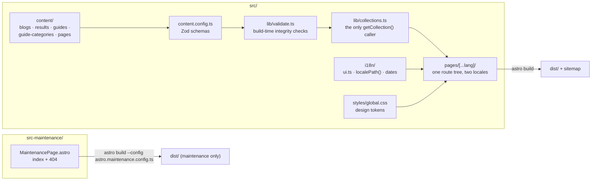
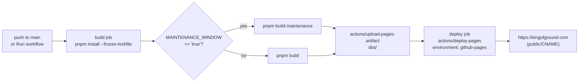

# kingofground.com

[](https://github.com/yasuflatland-lf/kingofground.com/actions/workflows/ci.yml)
[](https://github.com/yasuflatland-lf/kingofground.com/actions/workflows/deploy.yml)

🚲 The official site of **KING OF GROUND**, a BMX flatland contest series — a fully static, bilingual (Japanese / English) Astro 7 site built with Tailwind CSS 4, validated by Vitest and Biome in CI, and served from GitHub Pages at <https://kingofground.com>.

## Architecture

There is no server. Every page is rendered at build time from Markdown and YAML in `src/content/`, and the resulting `dist/` is uploaded to GitHub Pages by GitHub Actions.



### Content model

| Collection         | Source                                            | Rendered at                          |
| ------------------ | ------------------------------------------------- | ------------------------------------ |
| `blogs`            | `src/content/blogs/{ja,en}/<slug>.md`             | `/blogs/`, `/blogs/<slug>/`          |
| `results`          | `src/content/results/{ja,en}/<slug>.md`           | `/results/`, `/results/<slug>/`      |
| `guides`           | `src/content/guides/{ja,en}/<category>/<slug>.md` | `/101/<category>/<slug>/`            |
| `guide-categories` | `src/content/guide-categories/<category>.yaml`    | `/101/`, `/101/<category>/`          |
| `pages`            | `src/content/pages/{ja,en}/<slug>.md`             | standalone pages such as `/history/` |

- Each locale has its own subdirectory. A Japanese entry and its English translation are paired by having the **same relative path** (`ja/hello-kog.md` ↔ `en/hello-kog.md`); nothing in the frontmatter links them. An entry with no counterpart simply appears in one locale only.
- Schemas live in `src/content.config.ts` (Zod). `src/lib/validate.ts` adds checks the schema cannot express — a guide filed under a category with no YAML in `guide-categories/`, a `pages` entry missing its `ja` or `en` twin — and fails the build instead of shipping a half-translated site.
- `src/lib/collections.ts` is the single layer that calls `getCollection()`. Pages import only `render` from `astro:content`, so the content helpers in `src/i18n/` and `src/lib/` stay framework-agnostic and unit-testable.

### Internationalisation

Astro's built-in `i18n` is configured with `defaultLocale: 'ja'`, `locales: ['ja', 'en']` and `prefixDefaultLocale: false`. A single route tree under `src/pages/[...lang]/` serves both locales: `lang` is `undefined` for Japanese (`/results/`) and `'en'` for English (`/en/results/`). All UI copy lives in `src/i18n/ui.ts`; URLs are always built with `localePath()` rather than string concatenation. Rules and edge cases are in [docs/i18n.md](./docs/i18n.md).

### Two build targets

| Config                        | `srcDir`           | Output                                                       | Used when                                    |
| ----------------------------- | ------------------ | ------------------------------------------------------------ | -------------------------------------------- |
| `astro.config.ts`             | `src/`             | The full site with sitemap                                   | `MAINTENANCE_WINDOW` is anything but `true`  |
| `astro.maintenance.config.ts` | `src-maintenance/` | Only a maintenance page and its 404 — no content, no sitemap | `MAINTENANCE_WINDOW` is `true` (the default) |

The maintenance build reuses `global.css` and `ui.ts` from `src/` via relative imports, so the two targets never drift in look or wording. Both are built in CI on every PR.

### Deployment pipeline



`.github/workflows/ci.yml` runs on every pull request and on pushes to `main`; `.github/workflows/deploy.yml` runs on pushes to `main` and on manual dispatch. Both pin Node via `.node-version` and pnpm via the `packageManager` field in `package.json`.

## Pre-conditions

Production needs nothing beyond a GitHub repository, but a few settings must be configured once by hand. Local development needs none of these.

- **GitHub Pages** — _Settings → Pages → Source_ must be **GitHub Actions** (not "Deploy from a branch"), with _Custom domain_ set to `kingofground.com`. The same domain is committed in `public/CNAME` and in `site` of `astro.config.ts`.
- **DNS** — `A @` → `185.199.108.153`, `185.199.109.153`, `185.199.110.153`, `185.199.111.153`; `CNAME www` → `yasuflatland-lf.github.io`. Turn on _Enforce HTTPS_ once the records have propagated.
- **Renovate** — install the Mend Renovate GitHub App on the repository, enable _Allow auto-merge_ under _Settings → General_, and require the `ci` check in the `main` ruleset. Without the required check, Renovate's automerge never fires. The policy in `renovate.json`: wait 3 days after a release, automerge minor / patch, leave majors to a human except for GitHub Actions.

The step-by-step version of this list is in [docs/operations.md](./docs/operations.md).

## Quick Start

### 1. Prerequisites

| Tool     | Pinned by                                 | Notes                                                                                            |
| -------- | ----------------------------------------- | ------------------------------------------------------------------------------------------------ |
| **Node** | `.node-version` (24.x)                    | Any version manager that reads `.node-version` works — `mise`, `fnm`, `nvm`.                     |
| **pnpm** | `packageManager` in `package.json` (10.x) | `corepack enable` is the simplest way to get exactly the pinned version. CI uses the same field. |

### 2. Install and run

```bash
pnpm install
pnpm dev            # http://localhost:4321  — Japanese at /, English at /en/
```

To see the maintenance page instead of the site:

```bash
pnpm build:maintenance && pnpm preview
```

### 3. Verify before you commit

```bash
pnpm verify
# → biome ci → astro check → vitest run → astro build → astro build --config astro.maintenance.config.ts
```

`pnpm verify` runs the exact sequence CI runs. Content mistakes (a missing translation, an unknown category) surface as build failures, not as broken pages in production.

### 4. Deploy

Merging into `main` deploys. What gets deployed is decided by one switch, described next.

## Deployment

### The `MAINTENANCE_WINDOW` switch

`deploy.yml` builds either the maintenance page or the real site depending on `MAINTENANCE_WINDOW`:

```yaml
run-name: Deploy (maintenance=${{ inputs.maintenance_window || 'true' }})
env:
  MAINTENANCE_WINDOW: ${{ github.event.inputs.maintenance_window || 'true' }}
```

- **Default (`true`)** — every push to `main` publishes the maintenance page. This is the state the repository ships in.
- **Go live** — change the literal `'true'` to `'false'` in **both** places (`env:` and `run-name:`; `run-name` cannot read `env`, hence the duplication) and merge. From then on every push to `main` publishes the full site.
- **One-off override** — _Actions → Deploy to GitHub Pages → Run workflow_ and pick `maintenance_window` = `true` / `false`. The choice applies to that run only; the next push to `main` falls back to the default in the file.

The run name in the Actions list shows the effective mode (`Deploy (maintenance=false)`), so you can tell at a glance what a given run published. The input value is used only in `env:` and `if:` — never interpolated into `run:`.

### What a deploy does

1. `actions/checkout`, `pnpm/action-setup`, `actions/setup-node` with `.node-version` and the pnpm cache.
2. `pnpm install --frozen-lockfile`.
3. `actions/configure-pages`, then `pnpm build:maintenance` **or** `pnpm build` (never both).
4. `actions/upload-pages-artifact` from `dist/`.
5. A separate `deploy` job runs `actions/deploy-pages` against the `github-pages` environment. The `pages` concurrency group ensures deploys are serialised and never cancelled mid-flight.

There is no rollback command: to revert, revert the commit on `main` and let the next deploy run.

## Command reference

| Command                         | What it does                                                                                             |
| ------------------------------- | -------------------------------------------------------------------------------------------------------- |
| `pnpm dev`                      | Astro dev server with HMR                                                                                |
| `pnpm build` / `pnpm preview`   | Production build of the site / serve `dist/` locally                                                     |
| `pnpm build:maintenance`        | Build only the maintenance page (`astro.maintenance.config.ts`)                                          |
| `pnpm check`                    | `astro check` — TypeScript and `.astro` template diagnostics                                             |
| `pnpm lint` / `pnpm lint:fix`   | Biome (lint + format) on `.ts`, `.json`, `.css` and `.astro` frontmatter                                 |
| `pnpm test` / `pnpm test:watch` | Vitest — pure functions in `src/i18n` and `src/lib`, components via the Astro Container API, docs limits |
| `pnpm verify`                   | Everything CI runs, in CI order                                                                          |

## Repository layout

```
src/
  content.config.ts        Collection definitions (Zod schemas)
  content/                 Markdown / YAML content (see docs/content.md)
  i18n/                    Locale constants, UI strings, URL helper, date formatting — no Astro imports
  lib/content.ts           Entry-ID parsing, translation-pair lookup, sorting — no Astro imports
  lib/validate.ts          Integrity checks that fail the build — no Astro imports
  lib/collections.ts       The only module that calls getCollection()
  layouts/                 BaseLayout
  components/              Header, Footer, LanguageSwitcher, PageHeader, EntryList, ResultsTable, Hero, FeatureGrid, CtaBox
  assets/hero.svg          Line art for the hero
  pages/[...lang]/         Every page; lang undefined = ja, 'en' = en
  pages/404.astro
  styles/global.css        Design tokens (see docs/design.md)
src-maintenance/           Maintenance page; srcDir of astro.maintenance.config.ts
tests/                     Vitest (tests/docs/ enforces doc line limits and link validity)
docs/                      L2 / L3 documentation (hierarchy rules in AGENTS.md)
public/CNAME               Custom domain for GitHub Pages
astro.config.ts            Site build
astro.maintenance.config.ts  Maintenance-page build
.github/workflows/         ci.yml (PR + main), deploy.yml (main → GitHub Pages)
```

## Further reading

> AI agents: start at [AGENTS.md](./AGENTS.md). It is the L1 entry point — rules plus an index into `docs/` — and its line count and links are enforced by `tests/docs/limits.test.ts`. The table below is for human onboarding.

The documents under `docs/` are written in Japanese.

| Document                                     | Contents                                                                 |
| -------------------------------------------- | ------------------------------------------------------------------------ |
| [docs/development.md](./docs/development.md) | Stack, commands, directory layout, test strategy, Biome scope            |
| [docs/i18n.md](./docs/i18n.md)               | Locales, UI strings, URL rules, how translation pairs are matched        |
| [docs/content.md](./docs/content.md)         | Adding blog posts, contest results, 101 guides and standalone pages      |
| [docs/design.md](./docs/design.md)           | Colours, typography, Do / Don't (component dimensions in `docs/design/`) |
| [docs/operations.md](./docs/operations.md)   | CI and deploy, the `MAINTENANCE_WINDOW` switch, one-time setup, Renovate |
